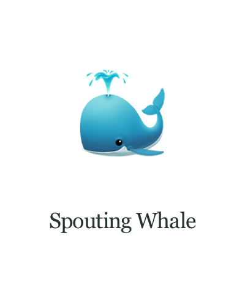
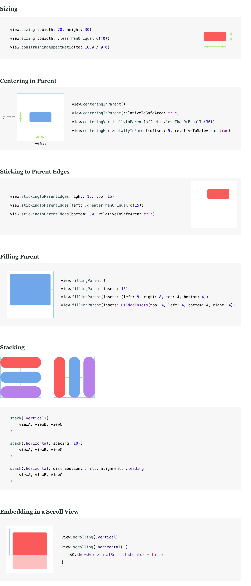
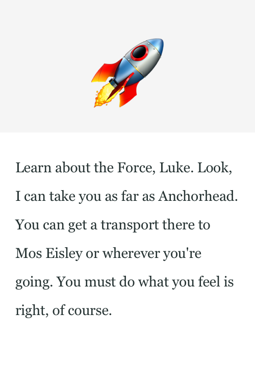

[](#carthage)
[](http://cocoadocs.org/docsets/Layoutless/)
[](https://twitter.com/srdanrasic)

# Layoutless

Layoutless enables you to spend less time writing UI code. It provides a way to declaratively style and layout views. Here is an example of how UI code looks like when written against Layoutless:



```swift
class ProfileView: View {

    let imageView = UIImageView(style: Stylesheet.profileImage)
    let nameLabel = UILabel(style: Stylesheet.profileName)

    override var subviewsLayout: AnyLayout {
        return stack(.vertical, alignment: .center)(
            imageView,
            nameLabel
        ).fillingParent(insets: 12)
    }
}
```

Layoutless is not just another DSL that simplifies Auto Layout code, rather it is a layer on top of Auto Layout and UIKit that provides a way to abstract common layout patterns and enable consistent styling approach. It is a very lightweight library - around 1k lines of code.

There are three main features of Layoutless.

## Layout Patterns

In order to make UI code more declarative, one has to have a way of abstracting and reusing common layout patterns like the sizing of views, laying a view out in a parent or stacking and grouping multiple views together. Layoutless makes this possible by providing types that enable you to make such patterns.

### Basic Patterns



### Walkthrough

Imagine that we need to build a news article screen where we have an image on top and a text below it representing the article body. First, we would define our views like: 

```swift
let imageView = UIImageView()
let bodyLabel = UILabel()
```

Let us now build our layout. A layout is something that defines how individual views are sized, positioned and structured withing a view hierarchy. Layoutless can represent layout with the `Layout` type, however, we rarely have to work with it directly because the framework provides extensions methods on UIView and few global functions that can be used to build layouts.

For example, to stack our two views vertically, we can use `stack` function:

```swift
let layout = stack(.vertical)(
    imageView,
    bodyLabel
)
```

Next, we would prefer if the body would have some side margins, so it is not laid out from the edge to the edge of the screen. That is as simple as insetting a view:

```swift
let layout = stack(.vertical)(
    imageView,
    bodyLabel.insetting(left: 18, right: 18)
)
```

All fine, until we hit a news article that does not fit on the screen. Oh boy, not scroll views... Well, with Layoutless they are a joy. To make our stack scrollable, all we have to do is chain one more method call:

```swift
let layout = stack(.vertical)(
    imageView,
    bodyLabel.insetting(left: 18, right: 18)
).scrolling(.vertical)
```

Now our stack is vertically scrollable. Finally, we need to define how our scrollable stack is laid out within the parent. We want to fill the parent, i.e. constrain all four edges to the parent's edges. We can do this:

```swift
let layout = stack(.vertical)(
    imageView,
    bodyLabel.insetting(left: 18, right: 18)
).scrolling(.vertical).fillingParent()
```

What we end up with is a `layout` variable that is an instance of the `Layout` type. It represents a description of our layout. Nothing has actually been laid out at this point yet. No constraints have been set up yet. To build the layout and make the framework create all relevant constraints and intermediary views, we need to lay our layout out:

```swift
layout.layout(in: parentView)
```

And that's it! The framework will create necessary Auto Layout constraints, embed the stack into a scroll view and add that as a subview of our parent view. To learn more about additional layout patterns, [peek into the implementation](https://github.com/DeclarativeHub/Layoutless/blob/master/Sources/Layout/Layoutless.swift). It's crazy simple! You can easily create your own patterns. If you think you have something that could be useful for everyone, feel free to make a PR.

Keep reading if you wish things were even simpler. 

## Base Views

Building declarative layouts is an awesome experience, but that last line to lay our layout out is not really declarative, it is an imperative call and we are not happy about it.

What we need is a place where we can just put our layout and let the "system" decide when it needs to be laid out. For that reason, Layoutless provides subclasses of base UIKit views that we should use as building blocks for our layouts. Those subclasses are very trivial, but they enable us to do this:



```swift
class ArticleView: View { // or ArticleViewController: ViewController

    let imageView = UIImageView()
    let bodyLabel = UILabel()

    override var subviewsLayout: AnyLayout {
        return stack(.vertical)(
            imageView,
            bodyLabel.insetting(left: 18, right: 18)
        ).scrolling(.vertical).fillingParent()
    }
}
```

`View` is basically a UIView subclass with `subviewsLayout` property that we can override to provide our own layout. That is all there is to it. [Check it out](https://github.com/DeclarativeHub/Layoutless/blob/master/Sources/Views/View.swift).

Layoutless provides base views like: `View`, `Control`, `Label`, `Button`, `ImageView`, `TextField`, etc.

## Styling 

For UI code to be more declarative, apart from solving the layout problem, we also have to solve the styling problem. It turns out, there is a very simple solution to that problem. You can find a detailed explanation of the solution presented in the [article about it](https://hackernoon.com/simple-stylesheets-in-swift-6dda57b5b00d), so let's just see how it works.

We will define something called Stylesheet in an extension of the view or the view controller we are about to style. A Stylesheet is just a namespace (i.e. an enum) with a collection of styles.

```swift
extension ArticleView {

    enum Stylesheet {

        static let image = Style<UIImageView> {
            $0.contentMode = .center
            $0.backgroundColor = .lightGray
        }

        static let body = Style<UILabel> {
            $0.font = .systemFont(ofSize: 14)
            $0.textColor = .black
        }
    }
}
```

As you can see, each style is an instance of `Style` type. You create Style by providing a closure that styles a view of a given type. That's all there is to it.

To use our styles, we will just instantiate our views using the convenience initializers provided by the framework:

```swift
class ArticleView: View {

    let imageView = UIImageView(style: Stylesheet.image)
    let bodyLabel = UILabel(style: Stylesheet.body)

    ...
}
```

😍

## Requirements

* iOS 9.0+ / tvOS 9.0+
* Xcode 9

## Installation

### Carthage

```
github "DeclarativeHub/Layoutless"
```

### CocoaPods

```
pod 'Layoutless'
```

## Communication

* If you would like to ask a general question, open a question issue.
* If you have found a bug, open an issue or do a pull request with the fix.
* If you have a feature request, open an issue with the proposal.
* If you want to contribute, submit a pull request (include unit tests).

## License

The MIT License (MIT)

Copyright (c) 2017-2018 Srdan Rasic (@srdanrasic)

Permission is hereby granted, free of charge, to any person obtaining a copy
of this software and associated documentation files (the "Software"), to deal
in the Software without restriction, including without limitation the rights
to use, copy, modify, merge, publish, distribute, sublicense, and/or sell
copies of the Software, and to permit persons to whom the Software is
furnished to do so, subject to the following conditions:

The above copyright notice and this permission notice shall be included in
all copies or substantial portions of the Software.

THE SOFTWARE IS PROVIDED "AS IS", WITHOUT WARRANTY OF ANY KIND, EXPRESS OR
IMPLIED, INCLUDING BUT NOT LIMITED TO THE WARRANTIES OF MERCHANTABILITY,
FITNESS FOR A PARTICULAR PURPOSE AND NONINFRINGEMENT. IN NO EVENT SHALL THE
AUTHORS OR COPYRIGHT HOLDERS BE LIABLE FOR ANY CLAIM, DAMAGES OR OTHER
LIABILITY, WHETHER IN AN ACTION OF CONTRACT, TORT OR OTHERWISE, ARISING FROM,
OUT OF OR IN CONNECTION WITH THE SOFTWARE OR THE USE OR OTHER DEALINGS IN
THE SOFTWARE.
